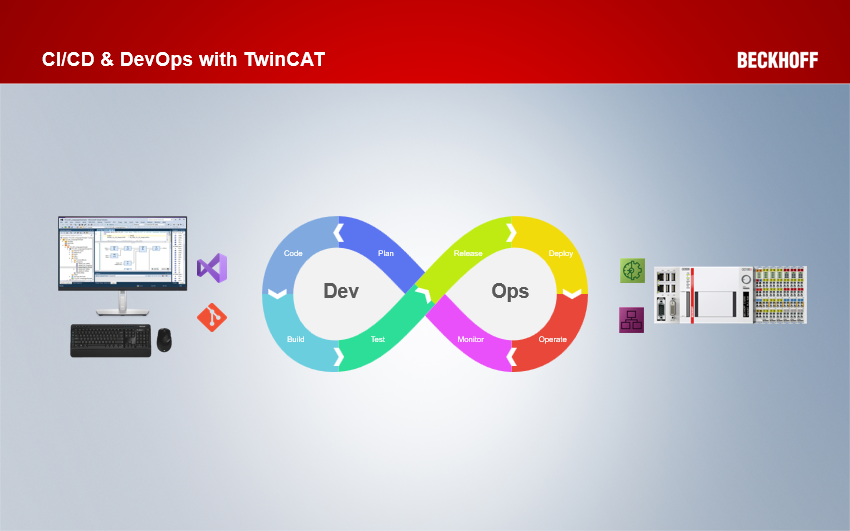
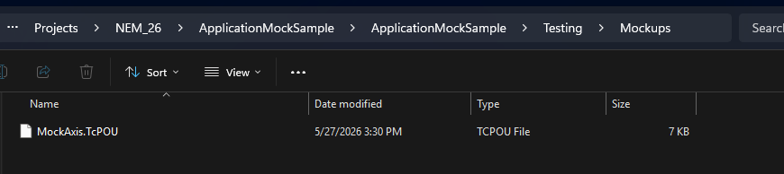
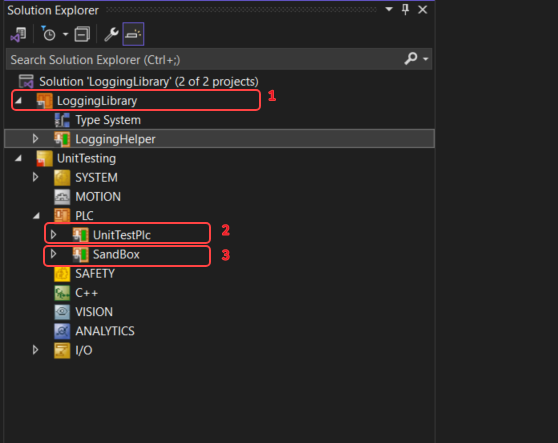

Pre-Requisites
===

You can follow along with the presentation to copy/paste code here: 

https://github.com/ctrostel90/NEM26_CICD_Workshop/presentation.md

or

https://ctrostel90.github.io/NEM26_CICD_Workshop/presentation.html

Everyone should've already installed

- TF1140 from the expirmental feed
- cloned the following sample repositories:

https://github.com/ctrostel90/NEM26_CICD_MockApplicationSample

https://github.com/ctrostel90/TwinCatLoggingHelper

<!-- end_slide -->

Goals
===

- Understanding what is CI/CD?
- What CI/CD tools does Beckhoff have?
- What is a Unit Test?
- What is TF1140 and basic usage
- How to write testable code

<!-- end_slide -->

Agenda
===

### Intro
<!--column_layout: [1,1]-->
<!-- column: 0-->
- What is CICD

<!--pause-->
### Testing Introduction
- What is Unit Testing
- Hands on exercises
- Testing Frameworks

<!-- pause-->
### TF1140 Unit Test Framework
- Introduction
- Exercises

<!--pause-->
### Programming Detour
- Slight detour to review some programming concepts
- Interfaces
<!--column: 1-->
<!--pause-->
### Unit Testing Pitfalls
- Code Coverage
- Approaching conversation with customers
- Adding unit testing to existing code bases


<!--pause-->
### Testable Code Bases
- Mockups
- Exercises

<!--pause-->
### Test Driven Development
- What is it?
- Hands On exercises

<!-- end_slide -->


CICD Presentation
===


To Powerpoint!

<!-- end_slide -->

Unit Tests
===
<!-- alignment: "center"-->
What is a unit test?

<!-- pause -->
It's an assertion

<!-- pause -->
```
Take a set of known inputs, if they go through a function, does the output equal what is expected?
```


```
ActualOutput = DoSomething(Inputs)
AssertEqual(ActualOutput,ExpectedOuput)
```

<!-- pause -->
With that, let's make one.

<!-- pause -->
To TwinCat!
<!-- end_slide -->
Making a UnitTest
===


We'll start with the most common basic exmaple, some simple math functions.

<!-- pause -->
Adder Function Block
===

Create a new FB, name it `Adder`. Add two inputs and an output

```js
FUNCTION_BLOCK Adder
VAR_INPUT
    Input1 : LREAL;
    Input2 : LREAL;
END_VAR
VAR_OUTPUT
    Output : LREAL;
END_VAR
VAR
END_VAR
```

```js
Output := Input1 + Input2;
```

<!-- end_slide -->
Our First Unit Tests
===

In our Main let's instantiate that `Adder`, and make a little test.

```js {1-5|7-11}
VAR
    TestAdder : Adder;
    runTest : BOOL;
    TestPass : BOOL;
END_VAR

IF runTest THEN
	runTest := FALSE;
	testAdder(Input1 := 1, Input2 := 2);
	TestPass := testAdder.Output = 3;
END_IF
```

Now we have a simple test! We can change the Adder's functionality and see the result of our test. 

<!-- end_slide -->
Divider Function Block
===

Let's expand and make another function block, a Divider.

```js
FUNCTION_BLOCK Divider
VAR_INPUT
    Input1 : LREAL;
    Input2 : LREAL;
END_VAR
VAR_OUTPUT
    Output : LREAL;
END_VAR
```
```js
Output := Input1 / Input2;
```
<!--end_slide -->

Divider Function Block
===

Add our first test to MAIN.

```js {1-5|7-11}
VAR
    TestDivider     : Divider;
    runDividerTest  : BOOL;
    DividerTestPass : BOOL;
END_VAR

IF runDividerTest THEN
    runDividerTest := FALSE;
    TestDivider(Input1 := 4, Input2 := 2);
    DividerTestPass := TestDivider.Output = 2;
END_IF
```

<!-- end_slide -->
More Tests!
===

Now we have a divider and a test.

But we have a divide by 0 potential. So let's make a test that will catch that and then implement the fix to make it pass.

In Main we'll add our test variables and test code

```js {1-4|6-10}
VAR
    runDividerTest2  : BOOL;
    DividerTestPass2 : BOOL;
END_VAR

IF runDividerTest2 THEN
    runDividerTest2 := FALSE;
    TestDivider(Input1 := 1, Input2 := 0);
    DividerTestPass2 := TestDivider.Output = 0;
END_IF
```

<!-- end_slide -->
More Tests!
===

Inside our Divider we'll check for Input2 to be 0.

```js
IF Input2 = 0 THEN
    Output := 0;
    RETURN;
END_IF

Ouput := Input1 / Input2;
```

<!-- end_slide -->
How Does this Scale?
===

Now we have 2 functions with a few test cases. 
<!-- pause-->
There are still plenty of more test cases we could want to ensure our function blocks could handle. Negative numbers, decimals etc etc.

<!-- pause-->

But this setup is cumbersome and really difficult for us to manage, we have to add all these extra boiler plate variables etc etc.

<!-- end_slide -->

Test Frameworks
===

Enter the Unit Testing Framework. This is what the framework provides. A set of tools to aide in writting and running unit tests.

There are lots of options you've likely heard about in our space of automation and TwinCat. Some examples: TcUnit, TestSuite, CoUnit, Codesys Test Manager to name a few. Each has their own pros and cons.

<!-- pause -->
But, we now have a framework!

<!-- end_slide -->
TF1140
===

We're not going to deep dive TF1140, but we'll use it moving forward in this workshop, so let's get a mile high overview

<!-- alignment: "center"-->
**To Powerpoint!**

<!-- end_slide -->
Refactor to use TF1140
===

Let's refactor to use TF1140 instead.

<!-- pause -->

Add in the Tc3_PlcTestFramework to the project.

Create a new FB named AdderTests. Use the following code as the header/declaration.

```js {1-11|1-3|4-7|7-11}
{ attribute 'Name':='Adder-Test' }
{ attribute 'Timeout':='t#5s' }
{ attribute 'Owner':='TestOwner' }
FUNCTION_BLOCK AdderTests EXTENDS FB_TestCaseBase
VAR
    AdderTest : Adder;
END_VAR

AdderTest(Input1 := 2, Input2 := 2);
AssertEqual(expected := 4, actual := AdderTest.Output);
Succeeded();
```

<!-- end_slide -->
Refactor to use TF1140
===
Create a new FB named DividerTests and add the following declaration and code snippet.

```js {1-19|1-3|4-7|9-19}
{ attribute 'Name':='Divider-Test' }
{ attribute 'Timeout':='t#5s' }
{ attribute 'Owner':='TestOwner' }
FUNCTION_BLOCK DividerTests EXTENDS FB_TestCaseBase
VAR
    DividerTest : Divider;
    ExpectedResult : LREAL;
    ActualResult : LREAL;
END_VAR

DividerTest(Input1 := 2, Input2 := 2);
ExpectedResult := 1;
ActualResult := DividerTest.Output;
AssertEqual(expected := ExpectedResult, actual := ActualResult);

DividerTest(Input1 := 2, Input2 := 0);
ExpectedResult := 0;
ActualResult := DividerTest.Output;
AssertEqual(expected := ExpectedResult, actual := ActualResult, message := 'Division by 0 not protected');
Succeeded();
```

<!-- end_slide -->
Refactor Continued
===

Finally, in our MAIN we can remove all our pre-existing code and add the necessary pieces for the testing framework.

```js {1-4|6}
VAR
    TestAdder : AdderTests;
    TestDivider : DividerTests;
END_VAR

Tc3_PlcTestFramework.TestController.TestCtrl(); 
```
After activating you can use the Test UI client to run our tests and see the results!

<!-- end_slide -->

Testable Code
===


To help give some strategies on how to write some testable code, we need to take a bit of a detour.

<!--pause -->

We're going to set the stage here by imaging we have a group of teachers. They all know how to teach. But they all teach different topics. One teaches math, another teaches history, another literature. Now, there is a student that is wanting to learn about all these topics. They don't know anything about how to teach or the topics they're learning. 

But they know that all of the teachers, have the ability to teach. 

So the student can go to every single teacher and ask "Teach me".

<!--end_slide -->

Testable Code
===
A code representation could look like this:

```js
FUNCTION_BLOCK HistoryTeacher
METHOD Teach
StudentKnowledge := StudentKnowledge + "History";
```

```js
FUNCTION_BLOCK MathTeacher
METHOD Teach
StudentKnowledge := StudentKnowledge + "Math";
```
```js

FUNCTION_BLOCK ScienceTeacher
METHOD Teach
StudentKnowledge := StudentKnowledge + "Science";
```

Because the teachers all know how to teach, any student can interact with a teacher in the same manner. They can come and be taught. The students know nothing about how the teaching is going to be done, only that there will be teaching done. This abstraction concept is a very important topic that we'll utilize heavily when we want to create testable code.

<!-- end_slide -->

Continuing the Example
===

Let's continue our example in some more code.

We first create a Teacher FB that has a local variable assocaited to it:

```js
FUNCTION_BLOCK Teacher
VAR
	_TeachTopic : E_TeachingTopic;
END_VAR
```
<!-- pause -->
The Teaching topic enumeration we create to have our 3 example topics from above.

```js
TYPE E_TeachingTopic :
(
	History,
	Math,
	Literature
);
END_TYPE
```

<!-- pause -->

Then for the Teacher Function block, we'll add a "TeachTopic" property that will assign the local _TeachTopic with a Getter/Setter function. 

<!-- end_slide -->
Teach Method Implementation
===

Finally, we'll create a `Teach` method that takes a "Student's knowledge" (represented as just a string here) that the Teacher will add their knowledge to it.

The implementation can look something like this:

```js {1-4|5-15}
METHOD Teach : STRING
VAR_INPUT
	Student : STRING;
END_VAR
CASE _TeachTopic OF
	E_TeachingTopic.History:
		CONCAT(Student, 'Learned History');

	E_TeachingTopic.Literature:
		CONCAT(Student, 'Learned Literature');

	E_TeachingTopic.Math:
		CONCAT(Student, 'Learned Math');
END_CASE
Teach := Student;
```
<!-- pause -->

But what if say, we start to add more specifics to the topic being taught. We want to have a Calculus teacher. But in order to teach Calculus they need to make sure that they already have learned algebra. Etc etc. The complexity of this one function starts to increase quite a bit. 

<!-- pause -->
And most importantly anytime you create a new Teacher instance, they all have this extra code in every single one. Even if they're just a Literature teacher.
<!-- end_slide -->
Enter: Interfaces
===


Instead, we can utilize the programming implementation of the first example of abstraction I just gave - interfaces

<!--pause -->
We'll start by adding two new Interfaces to our project named `I_Teacher` and `I_SubjectMatter`.

<!--end_slide -->
Enter: Interfaces
===
For the `I_Teacher` we'll add one Method `Teach()`:

```js
Teach : STRING
VAR_INPUT
    StudentKnowledge : STRING;
END_VAR
```

<!--pause -->
We'll also add a property that is called `SubjectMatter` of type `I_SubjectMatter`

<!--pause -->
For the `I_SubjectMatter`, we'll add a method named `GetKnowledge` that returns type `STRING`.

<!--pause -->
We'll now make a new Teacher object named TeacherOOP that implements `I_Teacher`. This teacher we'll define as follows:

```js
FUNCTION_BLOCK TeacherOOP IMPLEMENTS I_Teacher
VAR
	_SubjectMatter : I_SubjectMatter;
END_VAR
```

<!--pause -->
On our TeacherOOP object, in the getter/setter for the SubjectMatter property assign/return the `_SubjectMatter` variable

```js
GET:
    SubjectMatter := _SubjectMatter;
SET:
    _SubjectMatter := SubjectMatter;
```

Next step is to add an implementation to the `Teach()` method on the Teacher. For that we'll do the following:

```js {1-4|6-7}
Teach : STRING
VAR_INPUT
    StudentKnowledge : STRING;
END_VAR

CONCAT(StudentKnowledge, _SubjectMatter.GetKnowledge());
Teach := StudentKnowledge;
```
<!--end_slide -->
The final step is for us to create our Subject Matters. We'll make three quickly.

```js 
CalculusSubject IMPLEMENTS I_SubjectMatter

GetKnowledge() : STRING

GetKnowledge := 'Calculus';
```

```js
EnglishLiteratureSubject IMPLEMENTS I_SubjectMatter

GetKnowledge() : STRING

GetKnowledge := 'English Literature';
```

```js
ScientificMethod IMPLEMENTS I_SubjectMatter

GetKnowledge() : STRING

GetKnowledge := 'Scientific Method';
```

<!--end_slide-->
To use these in a program now we could do the following

```js {1-11|13-22}
MAIN
VAR
    TeacherOne : Teacher;

    //Subjects
    Calculus   : CalculusSubject;
    EnglishLit : EnglishLiteratureSubject;

    StudentOne   : STRING;
    ClassSubject : E_TeachingTopic;
END_VAR

CASE ClassSubject OF
    E_TeachingTopic.Calculus:
        TeacherOne.SubjectMatter := Calculus;
    E_TeachingTopic.EnglishLiterature:
        TeacherOne.SubjectMatter := EnglishLit;
END_CASE
IF ClassInSession THEN
    StudentOne := TeacherOne.Teach(StudentOne);
    CalcClassInSession := FALSE;
END_IF
```

<!-- pause -->
The benefit here is we've seperated out the topic of how to teach from the person teaching. We taken the responsibility of the 'objects' and seperated them out into smaller code sections. 

<!-- end_slide -->
Why this tangent in a class about unit testing?

<!-- pause -->
Because this is a methodology on how to write testable code. The teacher in order to teach, is dependant upon the topic. If the code for teaching that topic lies in the teacher, then we have to setup/control the that code anytime we want to test anything about the teacher. Seperated out, now we can test the two things independantly. We can test "Does the teacher actually teach when we tell them to teach?" not caring about the topic/methodology of teaching so much as their ability to teach. And we can test the subject matter for "Does the subject matter actually provide the correct information on the topic when taught?"

<!-- end_slide -->
Default Behavior
===

The final piece we'll talk about here is that we have our teacher that by default, doesn't know how to teach anything. So if a new teacher is made and a topic not assigned, we'll see a page fault if someone asks them to teach. Here we can make a "default behavior" so that if a teacher doesn't know a topic, they still can teach something.

So what does every teacher that can't teach teach?

```js
FUNCTION_BLOCK GymSubject IMPLEMENTS I_SubjectMatter

GetKnowledge() : STRING

GetKnowledge := 'Gym class';

```

We can then assign that as an initial value in the Teacher function block.

```js
FUNCTION_BLOCK Teacher
VAR
    _DefaultClass : GymSubject;
    _SubjectMatter : I_SubjectMatter := _DefaultClass;
END_VAR

```

What we've just implemented is the concept of dependency inversion and utilized the 'strategy pattern'. This is the "D" portion of the commonly referenced "SOLID" programming practices. The more of the SOLID practices that are followed, the easier code will likely become to unit test. 

<!-- end_slide -->
Should I Make a Unit Test???
===


Is this test, going to be worth the effort and help me ensure my code is safer? Very often you will run into when it's not worth the effort, and that's okay!

<!-- end_slide -->

Considerations When Testing
===


It's important and our job to understand what to actually test.
<!-- pause -->

For example: Do we need to test that MC_Power.Status goes true when the Execute boolean is true?
No, we want to test instead that our code behaves in the correct way when the output of Mc_Power.Status is True. Our code is responsible for preforming the application process, so we want to validate that. We can rely on the testing done by the MC2 library itself to validate it is actually enabling the axis.

<!-- end_slide -->
Code Coverage
===

Concept of code coverage

```js
IF Axis.Position > SafeZone THEN
    //We're safe to move, issue movement commands
ELSIF Axis.Error THEN
    //Do some specific error behavior
ELSE
    //We're not safe to move, don't allow movement commands
END_IF

```

<!-- pause -->
Code coverage looks and says you should have a test that covers all possible paths of the code execution. Every if condition/fork needs to have a test associated to it.

This is a dangerous concept to operate off of. You'll waste a lot of time if you approach this way.

<!-- pause -->
Instead we want to think about a behavior that we want to test. 

"I need to ensure that if my axis is not in the right position, we don't accidentally try to move other equipment"

```js
ExpectedResult := FALSE;
Axis.Position := SafeZone - 1;
Module.TryDangerousAction();
ActualResult := Module.DangerousActionResult;

Test.Assert(ExpectedResult,ActualResult)
```

This helps simplify your tests and keeps them focused. Making it so that you don't create endless tests.

<!-- end_slide -->

Mockups
===

We took a detour down OOP lane for a reason. Despite our best intentions to decouple software components from each other, our software components will have dependancies. Those dependancies can't be avoided. Have an application that's driving a conveyor belt? We're dependant on there being an axis.
<!-- pause-->
This means at times we're going to need to replace those dependancies with abstractions. Instead of depending on an actual axis control, we can create an abstraction axis, and swap out the code to use that. This is called a mockup, mockups with interfaces can aide us in the ability to make testable code.

It is also, very often where you have to decide if something is worth the effort.

<!-- end_slide -->
Mockup Exercise
===


For this exercise, we'll use a sample application prepared ahead of time. This application is an application to do some work on a product. It has a few pieces:
- A sensor to tell when a product is present in the system
- An Axis Controlling a product's position
- A cylinder that is used to do work on a product
- When a product is present, the product is moved to position, the cylinder is extended and held for a time before being retracted and the Axis moved to remove the product

<!-- pause -->
In the sample, there is a UnitTest already written. We want to test and validate that when we call the `Process.ProduceProduct()` method, the PartCount is incremented and the cylinder's position is retracted.

Let's open and test the project. 

<!-- pause -->
After starting the test however, you can see the test time's out! The axis never enables because there is no connection to the hardware. What can we do??

<!-- pause -->
Well, we can use a mockup axis and the 'Strategy Pattern' we learned about earlier!
<!-- end_slide -->
Mockup Exercises Cont'd
===

<!-- column_layout: [3,1]-->
<!-- column: 0-->
In the folder from the repository, there is a `MockAxis` folder. Add it to the UnitTest project.
<!-- column: 1-->

<!-- pause -->

<!-- column: 0-->
This is an example of how we can mock up the axis wrapper's behavior. 

We don't actually care when we're testing this process that the Axis is enabled and actually moves. If we're concerned that the AxisWrapper is working correctly, we can write a UnitTest specifically testing it's functionality. So in this case, the Mock mostly just fakes the control. When a MoveToPosition command is given, it sets an internal `_Position` variable to the commanded position. This is then returned with the `SetPosition` property that the `BasicProcess.ProduceProduct()` method utilizes.

<!-- pause -->

Next step is to use the mock.

Inside the `SimpleProcess` declration, make a new MockAxis and assign it in the init section.

```js
VAR
    _MockAxis : MockAxis;
END_VAR

IF NOT _Init THEN
    Process.ControlAxis := _MockAxis;
END_IF
```

Reactivate and run the test again. It should pass this time! This is an example of you can use Mockups and interfaces to decouple your code and make it testable.

<!-- pause -->

Of course, as mentioned earlier, the effort here can balloon if you're not careful so it's important to think critically at the start of the application if you're considering unit testing and architect appropriately to enable unit testing!!

<!-- end_slide -->

Existing Code Base Strategies
===

## Existing Code base, how can we add unit tests?
Find the low hanging fruit:
- Find the algorithims. 
- Find the math sections.
- Look for already decoupled code; a method that takes an input and sets some output only off those inputs

It can be really difficult to unit test sections of the application if the architecture isn't supporting it from the start as shown in the previous examples. In these cases where there wasn't a deliberate architecture implemented at the get go, the effort may exceed the benefit!

If there is still adamant interest, start looking for the smallest components. Look for sections that are part of a framework, start at the "bottom building blocks". An Axis wrapper, a recipe system etc.
<!-- pause -->
### I want to take the first steps into CI/CD, what do I do?

<!-- pause -->

In general, I believe any developer/user will benefit from taking any step further into adopting more/another CI/CD practice. But it should be incremental. If a user isn't using source control, it doesn't make sense to jump straight to deploying a build pipeline with automated deployment, static analysis and unit tests.

A good path is to understand what are the desired outcomes : 
- Interested in more unified code style? -> Static Analysis
- Interested in more stable code? -> Unit Testing, Source Control
- Managing versions in the field? -> Pipeline + Automation Interface

CI/CD is an a-la-carte system that the specific meal combination can be customized for the individual user
<!-- end_slide -->

Test Driven Development (TDD)
===

## What is it/What is it not?
TDD is a way of writing code that involves writing an automated unit-level test case that fails, then writing just enough code to make the test pass, then refactoring both the test code and the production code, then repeating with another new test case. It's an approach often discussed in books and in the IT field.

It's defined as the idea of having a very small loop:
1. Write a test that will fail
2. Write the code to make that test pass
3. Go back to step 1

<!-- pause -->
This approach if you follow it to the letter can seem incredibly slow. The idea is that you're constantly testing your code base and constantly building up regression tests. Personally I find this approach hard to be dilligent on and a little frustrating in our field with again, interacting with hardware. I think it's an admirable one to try and follow but again, practically speaking I know few teams that use this approach to a strict 'T' while developing software.

<!-- pause -->
## How can we you use it in your workflow?
<!-- pause -->
There are ways where this approach can be incredibly useful when applying it to development and one in particular I've found very useful. The most useful application I find applying the stricter TDD process is in the bug reporting/fixing workflow.

A bug is seen/reported on a software that you have unit testing on. There's a good chance when you see the bug, you have an idea on where to start looking, not always the case but often you'll have an idea. The first step however, is resist the temptation to go digging in the code and finding/fixing the bug. The first step is to write a unit test that shows the failure. Write a unit test that would pass if the behavior in question was working correctly. Then, once you have that, go start digging in code and trying to fix things. Think you've fixed it? run your unit test. Does it fail still? nope, you've not fixed it, back to the drawing board. Repeat this process until the test passes. Run the rest of your unit tests as a regression and close out the issue as done.

<!-- pause -->
Let's try some
<!-- end_slide -->
Example and Exercises
===

Time to do an exercise with a Logging Helper library.

This should already be cloned 

https://github.com/ctrostel90/TwinCatLoggingHelper

This is a library made mostly for this class however it is a generally useful tool. The library provides a wrapper around some basic logging functionality. It is rudimentary and logs to an Array of strings, however it could easily be expanded to also include logging to the EventLogger or whatever logging system you'd like.

The project contains:
<!-- column_layout: [1,1]-->
<!-- column: 0 -->
1. The Development Library Itself
2. A TF1140 Unit Testing Project
3. A Sandbox PLC project for testing/seeing the library in action

<!-- column: 1 -->


<!-- column: 0 -->
<!--pause-->
Open the solution and activate. Login to the Sandbox PLC project and you can set the various variables to see how the logging system behaves.

Additionally, let's take a look at the Unit tests and run them. They should all be passing and we can see their implementation running through a variety of basic unit tests for the library.

<!--pause-->
However there are some built in "undocumented features" in the library that we missed in development!

Let's try and find them and fix them using a TDD approach!

<!-- end_slide -->

Exercise 1
===

The library seems to be working okay, but you've received a bug report that a user is saying the Subscribed Logs "doesn't ever change value?"

- Create a unit test to recreate this problem
- Fix the bug
- Confirm the unit test passes
- Confirm all tests still pass

<!-- end_slide -->

Exercise 2
===

The library seems to be working okay, but you've received a bug report that a user is saying "I can never seem to fill the last message entry in the Log.Messages?"

- Create a unit test to recreate this problem
- Fix the bug
- Confirm the unit test passes
- Confirm all tests still pass

<!-- end_slide -->

Exercise 3
===

A user is asking "What does the severity do? I don't see it showing up anywhere?"


- Create/modify a unit test to recreate this problem
- Fix the bug
- Confirm the unit test passes
- Confirm all tests still pass

<!-- end_slide -->
Exercises Conclusion
===

Look at the `post_exercises` branch for a sample of how to complete if you get stuck/run out of time

<!-- end_slide -->

Fin!
===

Questions? 
Comments?

